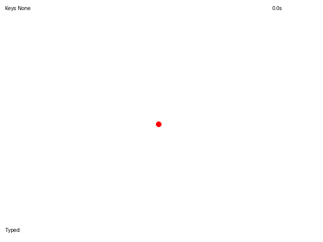

# VM-1: Vision-Language-Action Computer Use Model

> 🚧 Work in progress - coming soon
> 
> We're currently building the data collection pipeline. Check back later! https://github.com/viralmind-ai/gym-desktop

VM-1 is a research project focused on developing a vision-language-action model for computer interaction. The model aims to understand visual input, natural language, and generate appropriate computer actions.

## Components

### Action Tokenizer
[`fast_tokenizer.py`](./fast_tokenizer.py) implements an efficient action sequence compression system that converts 1-second sequences of computer actions into single tokens with 288 dimensions. This compressed representation enables autoregressive modeling of action sequences while preserving the high-frequency control patterns essential for gaming and other rapid-response tasks. The tokenization helps manage temporal complexity while preserving essential behavioral patterns and reducing training times.

Pre-trained tokenizer model available at: [physical-intelligence/fast](https://huggingface.co/physical-intelligence/fast)

Tokenization visualization: (1s@50hz)
- Before tokenization


- After tokenization



### GRPO Training
[`train_grpo.py`](./train_grpo.py) implements LLM training for coordinate prediction using techniques popularized by the DeepSeek-R1 model. This approach focuses on improving the model's ability to reason about and predict spatial coordinates in the context of computer interactions.

## Technical Details

- Action tokenization: 288-dimensional representation (using π's FAST+)
- Training approach: GRPO (inspired by DeepSeek-R1)
- Focus areas: Computer-use agents, language understanding, action generation
- High-frequency control: 50Hz action samples compressed into 1-second tokens

## Repository Structure

```
.
├── fast_tokenizer.py           # Action sequence compression implementation
├── train_grpo.py              # Coordinate prediction training
├── trajectory_before_tokenization.gif
└── trajectory_after_tokenization.gif
```
